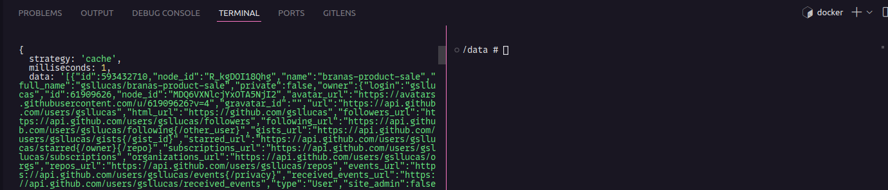
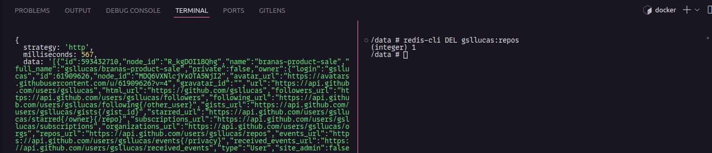

# Overview

Repository destinated to study app cache strategies, such as cache aside, using Redis.

Redis is a powerful tool for caching data in memory, which can increase application benchmark when consuming

By default, redis is set up with some default credentials, so when app is live for production, it is necessary to provide some configurations in `redis.conf` such as user, password and other settings like maxmemory allocation

## Used Technologies

- Redis 7.2.4-alpine
- Typescript 5.4.3
- Node v20.12.0

## Strategy Perfomance Comparison

**Cache Strategy: 1ms**



**HTTP Strategy: 567ms**



> Cache aside strategy can be even more rewarding when applied into massive recurrent data

## Getting Started

1. Install dependencies

```
npm install
```

2. Run redis with docker

> You can connect to redis with a different instance instead of running a docker, just be sure to let it running in redis://localhost:6379

```
docker compose up -d --build
```

3. Run application

```
npm run start
```

## Useful links

- Redis docs: https://redis.io/docs/about/
- Redis CLI docs: https://redis.io/docs/connect/cli/
- redis.conf settings: https://redis.io/docs/management/config-file/
- Redis docker hub: https://hub.docker.com/_/redis
